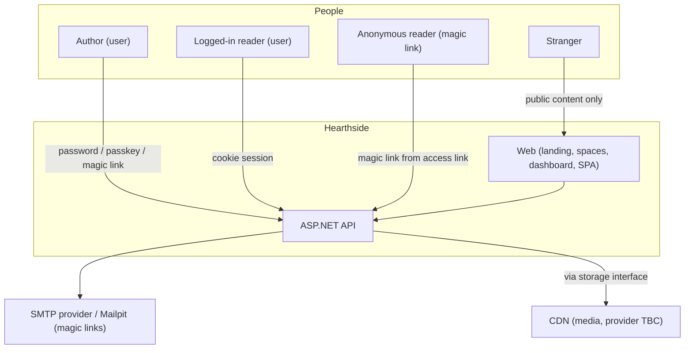
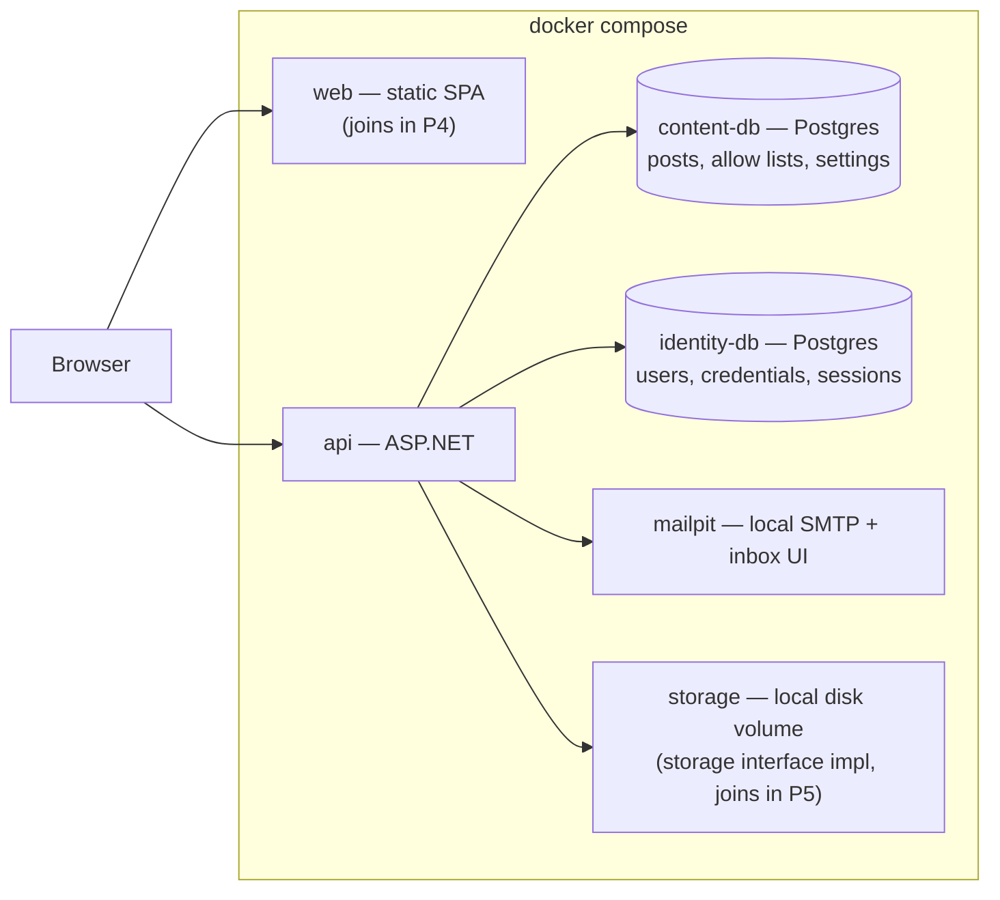
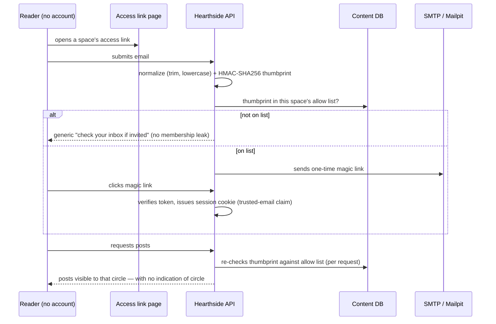
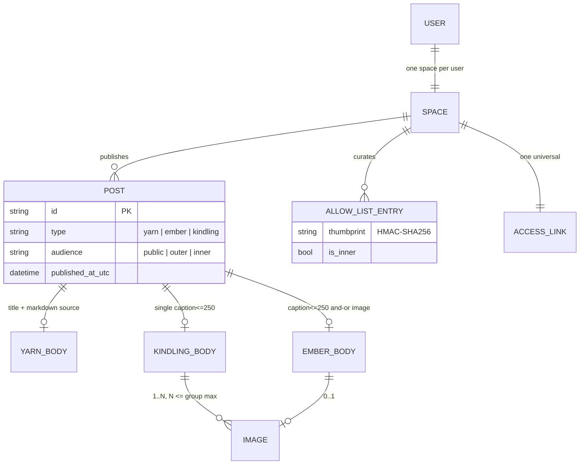

# Architecture

Status: **P0 — planned, no code.** These diagrams are normative intent: implementations
follow them, and deviations require an ADR. Vocabulary follows the
[`CONSTITUTION.md`](../CONSTITUTION.md) glossary.

## Post types at a glance

| Type | Shape | Rules |
|---|---|---|
| **Yarn** | title + long-form body | Markdown source retained (portability hedge) |
| **Ember** | caption *or* image *or* both | caption ≤250 chars; 0..1 images |
| **Kindling** | image group + one caption | 1..N images, N ≤ group max (global default 4, hard cap 12, feature-flag adjustable); caption optional, ≤250 chars |

Every post carries an **audience**: `public`, `outer`, or `inner`.

## System context

## Containers — local development

The concrete environment. All of it runs via one compose file (`infra/`), created
in P1 with `api`, `content-db`, `identity-db`, and `mailpit` only — `web` joins
in P4, `storage` in P5.

**Deploy variant (TBC, P6):** same services on a self-managed host behind a reverse
proxy, with a CDN (Cloudflare preferred, not committed) replacing the local storage
implementation via configuration only. Record as an ADR when scoped.

## Access & circle resolution — the heart of Hearthside

**Design notes**

- The access link is **universal per space** — one link, one allow list, the server
  silently resolves circles. The link itself can never leak circle membership.
- Sessions carry a **trusted-email claim**, not cached grants. Circle membership is
  re-derived per request (one HMAC + set lookup), so removing a thumbprint revokes
  access immediately.
- Authors reading other authors' gated content is the same rule in its logged-in
  form: the account's email is the trusted email; check it against each space's
  allow list. No special cases.

## Domain model

## Data ownership — two databases, one boundary

| Identity DB | Content DB |
|---|---|
| Users (accounts) | Posts (yarns, embers, kindling) |
| Credentials (password hashes, passkeys) | Allow lists (thumbprints + `is_inner`) |
| Sessions & magic-link tokens | Access links, settings, images metadata |

The identity DB is the **swappable auth boundary**: replacing the auth model
(OIDC, another IdP, anything) touches exactly one database and one adapter.
Allow lists are *audience curation owned by each author* — content, not identity —
so they survive any auth swap.

## Authentication summary

| Who | Mechanism |
|---|---|
| Authors (users) | Password or passkey; magic link optional |
| Readers | Magic link only (via access link) |
| Everyone | Cookie sessions; the cookie carries the trusted-email claim the frontend needs |

## Swappable boundaries

| Boundary | Dev implementation | Deploy implementation | Swap cost |
|---|---|---|---|
| Auth | Local identity DB | Same (or future IdP) | One DB + adapter |
| Media storage | Local disk volume | CDN-backed (Cloudflare/AWS/Azure, TBC) | Config + one implementation |

## Fediverse hedges (compatibility, not federation)

1. Stable **permalinks** for every post
2. **Portable content** — Markdown/HTML source retained, not just rendered output
3. **Author-as-actor identity** — stable IDs, display name, avatar fields
4. **UTC timestamps** with explicit `published_at` semantics
5. Content addressing that **never depends on reader accounts**

No ActivityPub fields, inboxes, or outboxes until federation is scoped.
